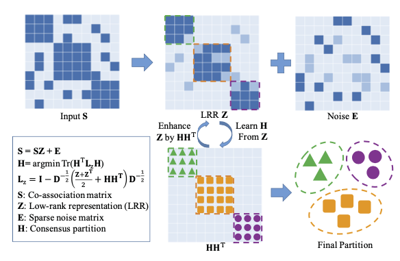

---

# Documentation: https://sourcethemes.com/academic/docs/managing-content/

title: "Literature Review #2: Robust Spectral Ensemble Clustering"
subtitle: ""
summary: "paper note"
authors: []
tags: [Ensemble Clustering; Spectral Clustering; Co-association Matrix; Low-rank Representation]
categories: []
date: 2019-12-27T17:43:32+09:00
lastmod: 2019-12-27T17:43:32+09:00
featured: false
draft: false

# Featured image

# To use, add an image named `featured.jpg/png` to your page's folder.

# Focal points: Smart, Center, TopLeft, Top, TopRight, Left, Right, BottomLeft, Bottom, BottomRight.

image:
  caption: ""
  focal_point: ""
  preview_only: false

# Projects (optional).

#   Associate this post with one or more of your projects.

#   Simply enter your project's folder or file name without extension.

#   E.g. `projects = ["internal-project"]` references `content/project/deep-learning/index.md` .

#   Otherwise, set `projects = []` .

projects: []
---
You can find this paper with its [doi](https://dl.acm.org/citation.cfm?doid=2783258.2783287).

Let's try to read the abstract together.

## Abstract

### Definitions of Ensemble Clustering (EC)

Ensemble Clustering (EC) aims to integrate multiple Basic Partitions (BPs) of the same dataset into a consensus one. It could be transformed as a graph partition problem on the **co-association matrix** derived from BPs.

### Problem

Existing EC methods usually directly use the co-association matrix, yet **without considering various noises** (e.g., the disagreement between different BPs or outliers) that may exist in it. These noises can impair the cluster structure of a co-association matrix and thus degrade the final clustering performance.

*Well, you almost can say everything without considering the noises.*

### Method : Robust Spectral Ensemble Clustering (RSEC)

1. RSEC learns a robust representation for the co-association matrix through low-rank constraint, which reveals the cluster structure of a co-association matrix and captures various noises in it.
2. RSEC finds the consensus partition by conducting spectral clustering.

 These two steps are iteratively performed in a unified optimization framework.

*Figure 1: An illustration of the proposed $RSEC$, which simultaneously learns a low-rank representation $Z$ for the co-association matrix $S$ and finds the consensus partition $H$ by conducting spectral clustering on $L_z$. We employ $Z$ to reveal the cluster structure of $S$, and capture the noises inside $S$ with a sparse error matrix $E$. During the learning process, we use $H$ to iteratively enhance the block-diagonal structure of $Z$. The final clustering result could be obtained either from H or $Z$.*

### Other details:

Most importantly, during our optimization process, we utilize consensus partition to iteratively enhance the block-diagonal structure of the learned representation to further assist the clustering process. Experiments on numerous realworld datasets demonstrate the effectiveness of our method compared with the state-of-the-art. Moreover, several impact factors that may affect the clustering performance of our approach are also explored extensively.

## 1. Somethings in Introduction:

The contributions of this work are summarized as three-folds:

1. A unified optimization framework is provided to simultaneously learn a robust representation for the co-association matrix and find the final consensus partition.

2. The block-diagonal structure of the learned representation is iteratively enhanced by a consensus partition during the optimization process, thus it better uncovers the cluster structure of the co-association matrix.

*But, if the order is random, block-diagonal structure may not be found, right?*

3. Experiments conducted on twelve real-wold datasets demonstrate the effectiveness of our approach over the state-of-the-art EC methods. Moreover, several impact factors that may affect the clustering performance of RSEC are also explored extensively.

## 2. Somethings in related work

### 2.1 Ensemble Clustering

The first category employs a utility function to measure the similarity between the consensus clustering and multiple BPs, and usually finds the final partition by maximizing an explicit objective function.

 For instance, 

For instance, Topchy et al.[27] proposed a Quadratic Mutual Information based objective function for consensus clustering, and used K-means clustering to find the solution. They further extended their work to using the EM algorithm with a finite mixture of multinomial distributions for consensus clustering [28]. Along this line, Wu et al.[32] transferred the ensemble clustering into a K-means clustering problem with KCC utility function and gave the necessary and sufficient conditions for KCC utility functions. In addition, there are some other interesting objective functions for the ensemble clustering, such as the ones based on nonnegative matrix factorization [12], kernel-based methods [30], and simulated annealing [18], respectively.

The second category summarizes the information of input BPs into a co-association matrix, which counts how many times two instances occur in the same cluster. The co-association matrix ac- tually represents the pairwise similarity of all the data points in the partition space. Thus, a graph partition algorithm can be conducted on it to obtain the final clustering result.

 For instance, 

Strehl and Ghosh [26] developed three graph-based algorithms for consensus clustering, while Fred and Jain [8] applied the agglomerative hierarchical clus- tering. Recently, Liu et al.[16] proposed a spectral ensemble clus- tering method, which ran spectral clustering on the co-association matrix and transformed it as a weighted K-means problem to achieve high efficiency. Other methods include Relabeling and Voting [1], Locally Adaptive Cluster based methods [6], genetic algorithm based methods [38], and still many more.

### 2.2 Low-Rank Matrix Analysis

LRR [15, 14] assumes the data are drawn from a union of multiple low-dimensional subspaces, and tries to recover these subspaces by seeking the lowest rank representation Z for X as:

$$
\min _{\mathbf{Z}, \mathbf{E}} \operatorname{rank}(\mathbf{Z})+\lambda\|\mathbf{E}\|_{0} \text { s.t.} \mathbf{X}=\mathbf{X} \mathbf{Z}+\mathbf{E}
$$

where λ > 0 balances the rankness of Z and the sparseness of the error matrix E.

Since Eq.(1) is a NP-hard problem, we usually solve its convex relaxation by using nuclear norm to estimate the rank(Z) and l1 or l2, 1 norm to approximate ∥E∥0. Actually, since the minimizer of Eq.(1) also obtains a low-rank matrix XZ for X, LRR could be seen as a generalization for the Robust PCA [14]. It is worthy to note that, by utilizing X to express itself, Z is actu- ally a similarity matrix that reveals the membership between data points. Moreover, it has been proven that Z enjoys a nice block- diagonal property [14, 37], which can uncover the global structure of data and further facilitate the clustering task. Therefore, in this paper, we employ LRR to learn a robust representation for the co- association matrix, rather than directly recover it as a low-rank one.

*Emmy, I guess this is important for this paper. I'm not very clear what author said. It seems works.*

## 3. ROBUST SPECTRAL ENSEMBLE CLUSTERING

Let X = {x1, x2, ··· , xn} be a set of n data points independently sampled from K clusters, represented as C = {C1 , · · · , Ck }.

Denote Π = {π1, π2, ··· , πr} as r input basic partitions (BPs), each of which divides X into Ki crisply partitions and maps X into a label set πi = {πi(x1), πi(x2), · · · , πi(xn)}, where Ki is the cluster number for the i-th BP, 1 ≤ πi(xj) ≤ Ki, and 1 ≤ i ≤ r, 1 ≤ j ≤ n.

Note that, the cluster number of each BP is usually set to be different for achieving the diversity among input BPs, which has been recognized as an efficient manner to ensure the success for ensemble clustering [1, 32].

*Agree*

The goal of ensemble clustering is to find the consensus parti- tion that agrees with input BPs most and divides X into its origi- nal K clusters. Commonly, EC methods may summarize r BPs as a co-association matrix, and then conduct a graph partition algo- rithm to obtain the final consensus clustering, denoted as π. The co-association matrix S ∈ Rn×n actually calculates the times of two instances occurring in the same cluster based on Π, which is defined as [8]:

$$
\mathbf{S}\left(x_{p}, x_{q}\right)=\sum_{i=1}^{r} \delta\left(\pi_{i}\left(x_{p}\right), \pi_{i}\left(x_{q}\right)\right)
$$

where $x_{p}, x_{q} \in \mathcal{X}$ and δ(a, b) is 1 if a = b; 0 otherwise. Obvi- ously, S could be normalized by S = S/r. Inspired by [16], we apply the spectral clustering on the co-association matrix S, and have its trace minimization form by following [19] as

$$
\min _{\mathbf{H}} \operatorname{tr}\left(\mathbf{H}^{\mathrm{T}} \mathbf{L}_{s} \mathbf{H}\right) \text { s.t.} \mathbf{H}^{\mathrm{T}} \mathbf{H}=\mathbf{I}, 
$$

$$
\mathbf{L}_{s}=\mathbf{I}-\mathbf{D}_{s}^{-1 / 2} \mathbf{S} \mathbf{D}_{s}^{-1 / 2}
$$

of S, with degree matrix $D_s$ ∈ Rn×n being a diagonal matrix whose jth diagonal element is the sum of the jth row of S, and H ∈ Rn×K is defined as the scaled partition matrix of π:

$$
\mathbf{H}_{j k}=\left\{\begin{array}{ll}{1 / \sqrt{\left|C_{k}\right|}, } & {\text { if } x_{j} \in C_{k} \text { in } \pi} \\ {0, } & {\text { otherwise }}\end{array}\right.
$$

We can use H to represent the final ensemble clustering result.

*Really? interesting, this is first time I read this.*

### 3.2 Problem Formulation

Given a normalized co-association matrix S, the objective func- tion of our RSEC is formulated as:

$$
\begin{array}{l}{\min _{\mathbf{H}, \mathbf{z}, \mathbf{E}} \operatorname{tr}\left(\mathbf{H}^{\mathrm{T}} \mathbf{L}_{z} \mathbf{H}\right)+\lambda_{1}\|\mathbf{Z}\|_{*}+\lambda_{2}\|\mathbf{E}\|_{2, 1}} \\ {\text { s.t.} \mathbf{H}^{\mathrm{T}} \mathbf{H}=\mathbf{I}, \mathbf{S}=\mathbf{S} \mathbf{Z}+\mathbf{E}}\end{array}
$$

with
$$
\mathbf{L}_{z}=\mathbf{I}-\mathbf{D}_{z}^{-1 / 2}\left(\left(\mathbf{Z}+\mathbf{Z}^{\mathrm{T}}\right) / 2+\mathbf{H} \mathbf{H}^{\mathrm{T}}\right) \mathbf{D}_{z}^{-1 / 2}
$$
where \(\mathbf{H}\) denotes the consensus partition, \(\mathbf{Z} \in \mathbb{R}^{n \times n}\) is the learned
representation, \(\mathbf{E} \in \mathbb{R}^{n \times n}\) is an error matrix that tries to capture
various noises inside \(\mathbf{S}, \) and \(\lambda_{1}, \lambda_{2}>0\) are two penalty parameters
to balance the corresponding terms. In Eq.(5), \(\mathbf{L}_{z}\) is designed as a
normalized Laplacian matrix of the graph constructed by \(\mathbf{Z}\) and \(\mathbf{H}, \)
and the degree matrix \(\mathbf{D}_{z}\) is computed by:

$$
\mathbf{L}_{z}=\mathbf{I}-\mathbf{D}_{z}^{-1 / 2}\left(\left(\mathbf{Z}+\mathbf{Z}^{\mathrm{T}}\right) / 2+\mathbf{H} \mathbf{H}^{\mathrm{T}}\right) \mathbf{D}_{z}^{-1 / 2}
$$

where \(d_{j}, 1 \leq j \leq n, \) is the sum of the \(j\) -th row of the matrix
\(\left(\mathbf{Z}+\mathbf{Z}^{\mathrm{T}}\right) / 2+\mathbf{H} \mathbf{H}^{\mathrm{T}}\). Here, we employ \(\left(\mathbf{Z}+\mathbf{Z}^{\mathrm{T}}\right) / 2\) instead of \(\mathbf{Z}\)
to achieve a symmetric graph. Moreover, since \(\mathbf{H}\) is a high-quality
clustering result, \(\mathbf{H} \mathbf{H}^{\mathrm{T}}\) enjoys a clear cluster structure. Thus, we
use it to further enhance the block-diagonal structure of \(\mathbf{Z}\).

### 3.3 Optimization : The Augmented Lagrange Multiplier (ALM)

The Augmented Lagrange Multiplier (ALM) method [13] comes to
mind as an efficient and effective solver to our problem. To apply
ALM, we first introduce an auxiliary variable J to make Eq.(5)
separable, and equivalently convert it as:

$$
\begin{array}{ll}{} & {\min _{\mathbf{H}, \mathbf{Z}, \mathbf{E}} \operatorname{tr}\left(\mathbf{H}^{\mathrm{T}} \mathbf{L}_{z} \mathbf{H}\right)+\lambda_{1}\|\mathbf{J}\|_{*}+\lambda_{2}\|\mathbf{E}\|_{2, 1}} \\ {} & {\text { s.t.} \mathbf{H}^{\mathrm{T}} \mathbf{H}=\mathbf{I}, \mathbf{S}=\mathbf{S} \mathbf{Z}+\mathbf{E}, \mathbf{Z}=\mathbf{J}}\end{array}
$$

Following \([5], \) the constraint \(\mathbf{H}^{\mathrm{T}} \mathbf{H}=\mathbf{I}\) is relaxed to avoid hard
partition during the optimization process. Then, the augmented La-
grangian function of Eq.( 8) is:

\(\begin{aligned} \mathcal{L}=& \operatorname{tr}\left(\mathbf{H}^{\mathrm{T}} \mathbf{L}_{z} \mathbf{H}\right)+\lambda_{1}\|\mathbf{J}\|_{*}+\lambda_{2}\|\mathbf{E}\|_{2, 1} \\ &+\left\langle\mathbf{Y}_{1}, \mathbf{S}-\mathbf{S} \mathbf{Z}-\mathbf{E}\right\rangle+\left\langle\mathbf{Y}_{2}, \mathbf{Z}-\mathbf{J}\right\rangle \\ &+\frac{\mu}{2}\left(\|\mathbf{S}-\mathbf{S} \mathbf{Z}-\mathbf{E}\|_{\mathrm{F}}^{2}+\|\mathbf{Z}-\mathbf{J}\|_{\mathrm{F}}^{2}\right) \end{aligned}\)

where Y1 and Y1 are two Lagrangian multipliers, and μ > 0 is the penalty parameter.

The ALM solver solves Eq.(9) with an iterative update manner, which addresses J, Z, E, and H in sequence and optimizes one variable at a time by fixing the others. More details are given in the following.

#### Updata J.

We first minimize \(\mathcal{L}\) with respect to \(\mathrm{J}, \) and obtain \(\mathrm{J}^{(t+1)}\)
by:
$$
\begin{aligned} \quad & \text { argmin } \lambda_{1}\|\mathbf{J}\|_{*}+\left\langle\mathbf{Y}_{2}^{(t)}, \mathbf{Z}^{(t)}-\mathbf{J}\right\rangle+\frac{\mu^{(t)}}{2}\left\|\mathbf{Z}^{(t)}-\mathbf{J}\right\|_{\mathrm{F}}^{2} \\
= \underset{\mathbf{J}}{\operatorname{argmin}} \frac{\lambda_{1}}{\mu^{(t)}}\|\mathbf{J}\|_{*}+\frac{1}{2}\left\|\mathbf{J}-\left(\mathbf{Z}^{(t)}+\frac{1}{\mu^{(t)}} \mathbf{Y}_{2}^{(t)}\right)\right\|_{\mathrm{F}}^{2} \end{aligned}
$$

Eq.(10) could be solved by the Singular Value Thresholding (SVT) operator [3], which has a closed-form solution as:

$$
\begin{array}{c}{\mathbf{J}^{(t+1)}=\Theta_{\frac{\lambda_{1}}{\mu^{(t)}}}\left(\mathbf{Z}^{(t)}+\frac{1}{\mu^{(t)}} \mathbf{Y}_{2}^{(t)}\right)} \\ {\text { where } \Theta(\cdot) \text { is the SVT operator.}}\end{array}
$$

#### Update Z

Update \(\mathbf{Z} .\) By substituting Eq.(6) into \(\mathcal{L}\) and dropping unrelated
terms, the subproblem for updating \(\mathbf{Z}\) is equivalent to the following: \\
argmin \(-\frac{1}{2} \operatorname{tr}\left(\mathbf{H}^{(t) T} \mathbf{D}_{z}^{-1 / 2}\left(\mathbf{Z}+\mathbf{Z}^{\mathrm{T}}\right) \mathbf{D}_{z}^{-1 / 2} \mathbf{H}^{(t)}\right)\)
\(\quad+\left(\mathbf{Y}_{1}^{(t)}, \mathbf{S}-\mathbf{S} \mathbf{Z}-\mathbf{E}^{(t)}\right\rangle+\left\langle\mathbf{Y}_{2}^{(t)}, \mathbf{Z}-\mathbf{J}^{(t+1)}\right\rangle\)
\(\quad+\frac{\mu^{(t)}}{2}\left(\left\|\mathbf{S}-\mathbf{S} \mathbf{Z}-\mathbf{E}^{(t)}\right\|_{\mathbf{F}}^{2}+\left\|\mathbf{Z}-\mathbf{J}^{(t+1)}\right\|_{\mathbf{F}}^{2}\right)\)

Note that, the derivative of \(\mathbf{D}_{z}\) with respect to \(\mathbf{Z}\) is relatively complex, which actually complicates the solution of obtaining \(\mathbf{Z}^{(t+1)} .\)

By fixing \(D_{z}, \) Eq.( 12) becomes a quadratic problem of \(\mathbf{Z} .\) Thus, 
taking the derivative of \(\mathcal{L}\) with respect to \(\mathbf{Z}\) gives \(\mathbf{Z}^{(t+1)}\) as:
\(\mathbf{Z}^{(t+1)}=\left(\mathbf{S S}^{\mathrm{T}}+\mathbf{I}\right)^{-1}\left(\mathbf{S}^{\mathrm{T}} \mathbf{S}+\mathbf{J}^{(t+1)}-\mathbf{S}^{\mathrm{T}} \mathbf{E}^{(t)}+\right.\)
\(\left.\quad \frac{1}{\mu^{(t)}}\left(\mathbf{S}^{\mathrm{T}} \mathbf{Y}_{1}^{(t)}-\mathbf{Y}_{2}^{(t)}+\mathbf{D}_{z}^{-1 / 2} \mathbf{H}^{(t)} \mathbf{H}^{(t) \mathrm{T}} \mathbf{D}_{z}^{-1 / 2}\right)\right)\)

#### Update E.

#### Update Multipliers

