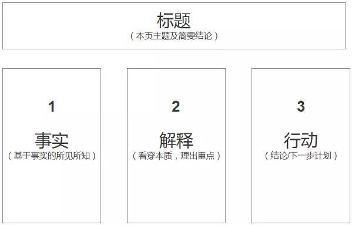

前言，这是写给研究室同学的一个教学文章。目的是让大家快速学会很多我亲身验证好用的工具，以便大家日后在研究和工作时能更加游刃有余。
另外由于时间和精力有限，这里所有的内容，或者工具推荐的具体使用方法请自行上网搜索。

# 操作系统OS

大家都有mac电脑了，如果之前没用过得话，还得适应一下可能。

## 从Windows转到macOS
- 要从Windows转到macOS吗?
  - 随便。不过就算你不用macOS来工作，你可以装一个chrome浏览器，在macOS下看网页，聊微信，做休闲的事。这样的好处是，当有一天你要转过来用mac的时候不至于完全不会。

- 快捷键都不一样，怎么办？
  - CheatSheet for mac 可以帮到你。[B站视频介绍](https://www.bilibili.com/s/video/BV1KV411k7EN)

- macos的反斜杠\\怎么打出来。
  - option + ¥

- macOS有什么优势。
  - 有一个原生的Linux内核，命令行比较好用，不用担心中毒。电池比较好。跟手机一样，可以永远不关机，打开屏幕就能用，记得充一下电就好。

### macOS 哪些自带的软件好用

基本都好用，除了Safari，我不用以外。

- mail：邮件可以登录很多邮箱，然后按你喜欢的方法标记不同颜色的旗子，加vip邮箱，等你收到几千封邮件的时候你就知道找邮件有多难了，这样的标签分类方法非常好用，我也把这个方法教给了叶老师，她亲测好用。
- Calendar：把日程写在日历上，这样会很容易安排日程，如果不用脑记事情，就能用脑搞科研了。
- preview 自带的pdf浏览器，很好用，标记文字，还可以做电子签名。
- Finder 文件浏览器，长按空格可以快速浏览。
- Notes 随手记一下东西可以用，虽然这个软件也挺强大的了，但是还远远不够。

# 效率工作

## Alumni mail

这是筑波大学校友终身邮箱，自带所有企业版Google用户的服务内容。如：
- 空间无限的[虚拟云端硬盘](https://workspace.google.com/products/drive)，这个可以就像本地硬盘一样用，但是不会占多少磁盘空间，重点推荐。
- 空间无限云相册，手机相册原图无限空间备份。
- 邮箱
- 其他

如果还没有注册，在这里[注册](https://futureship.sec.tsukuba.ac.jp/alumni/mail/)。

## google drive 

就是上面的[虚拟云端硬盘](https://workspace.google.com/products/drive)。这个有什么用，可以把你的所有资料全部放进去。这就不存在你的资料在你的另一台电脑里面，要是找一个文件，就要换电脑找这种问题了。

而且这个用起来就像随时插了一块移动硬盘一样，速度也很快。我写程序都在里面直接写，这样笔记本和台式机切换着用，文件内容也是一样的。非常方便。

而且所有文件都在云端，那么就算身边只有一台手机也能随时查看文件了。

具体使用方法，请自己学习。

## Chrome extensions 

Q1: 要装这个浏览器吗？

A1: 推荐。因为能装插件。

推荐安装的插件清单：

- adbolck 屏蔽广告，很好用。

- google scholar 谷歌学术，可以方便查论文。
- tab wrangler 自动关闭长期不用的选项卡。
- read aloud 可以朗读屏幕内容，各种语言都可以，读得很好。

- vimium 把浏览器变成vim操作的，学会了会方便一点。

## 做笔记怎么做

- 首先，要想清楚我们每天要高效地工作，主要靠什么。难道靠脑子来记吗。
  - 当项目中有很多事情都不清楚的时候，如何厘清头绪，这个时候不要靠动脑，连事情都搞不懂，要先动手。把其中的细节一个一个整理出来，了解细节的基础上，分析和思考才有用。
    - 那么怎么做？
      - 当然是做笔记了，只有做笔记才能解放大脑来思考。
- 然后，怎么做笔记。
  - 用纸来做笔记，手写不伤眼睛，还可以写写画画。
  - 在线笔记，又可以文字，还可以图片，还可以表格。
  - 问题来了，那种笔记最可以帮助思考。
    - 表格。
      - 哪种表格最可以帮助思考。
        - 黄金三分法 [B站视频教程，方格笔记术](https://www.bilibili.com/video/BV16t411i7tB?p=6)
        
- 在线笔记怎么记。
  - 打开就写。
  - 加个标题写。
  - 找个模板写。
  - 哪个好？
    - 找模板写好。模板是别人智慧的结晶，事半功倍的关键。
  - 在线笔记哪家强。
    - notion > evernote > others。我是evernote的付费老用户，直到见到notion了以后。notion特别是表格特别方便，就像我上面提到的，把各种细节放在表格一行里面，这样看上去一览无余，非常轻松，这是非常方便的。[notion的个人知识体系如何代建](https://www.bilibili.com/video/BV1iv4y1o7KJ?share_source=copy_web)
- 最后，读论文怎么做笔记。
  - 如果你像我一样没有什么高科技的书写设备。打印出来，在上面写批注是最简单的方式。
  - 写哪些批注?
    - 重要参考文献的题目，应该标注，否则就不知道他表达的是什么。
    - 不会的单词意思。
    - 疑问。重中之重。有疑问是最好的，哪里不懂，哪里就是突破点，赶快标注出来。等全文读完之后，就知道接下来要学习的方向在哪里了。
    - 自己给文章分段，写出每段的小标题。这样就对文章结构清晰了。

## 写程序用什么ide

vscode 支持语言多，另外可以直接访问服务器，直接在服务器上写代码，是不是很厉害。

## 写论文
- Overleaf 在线latex 还可以多人协作
- Grammarly 语法检查, 办了会员还可以查重。我有时回去淘宝买一个会员来用。
- Manchester Academic Phrasebank 偶尔有用，可以查各种时候的表达句型。

## 学术圈工具

- [google scholar](https://scholar.google.com/citations?user=W9oaUkgAAAAJ&hl) 谷歌学术
- [resarchgate](https://www.researchgate.net/profile/Hongmin-Li-7) 学术圈社交网络
- [researchmap](https://researchmap.jp/hongmin) 日本学术圈社交网络
- [linkedin](https://www.linkedin.com/in/li-hongmin) 职业圈社交网络，可以加个好友，帮我的技能项上点赞什么的。得到奖学金，有什么RA可以在上面更新，临近毕业的时候会有猎头来介绍工作的。
- [github](https://github.com/Li-Hongmin) 这个是要经营的，我没有管它，所以没啥亮点。来follow我啊。
