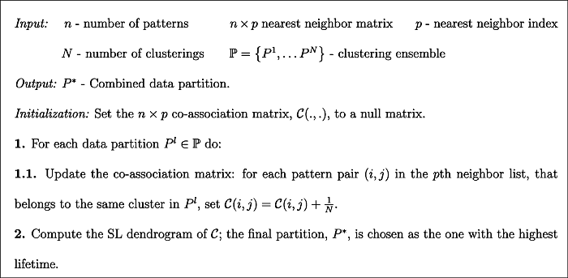
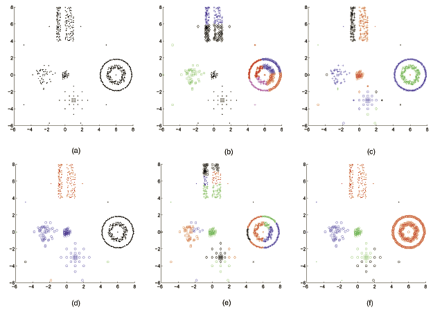
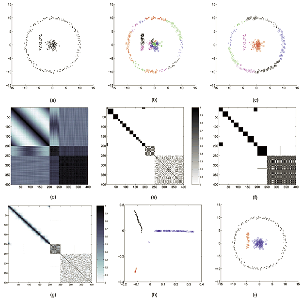
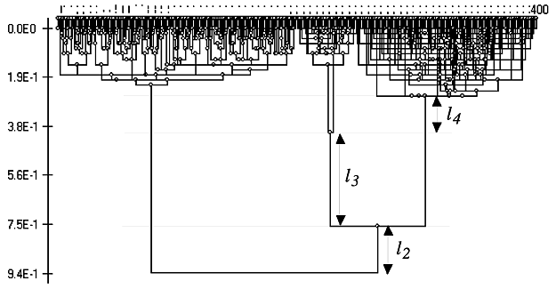

---

# Documentation: https://sourcethemes.com/academic/docs/managing-content/

title: "Literature Review #1: Combining multiple clustering using evidence accumulation
"
subtitle: ""
summary: ""
authors: []
tags: [clustering ensemble, consensus clustering, voting]
categories: []
date: 2019-12-24T16:04:40+09:00
lastmod: 2019-12-24T16:04:40+09:00
featured: false
draft: false

# Featured image

# To use, add an image named `featured.jpg/png` to your page's folder.

# Focal points: Smart, Center, TopLeft, Top, TopRight, Left, Right, BottomLeft, Bottom, BottomRight.

image:
  caption: ""
  focal_point: ""
  preview_only: false

# Projects (optional).

#   Associate this post with one or more of your projects.

#   Simply enter your project's folder or file name without extension.

#   E.g. `projects = ["internal-project"]` references `content/project/deep-learning/index.md` .

#   Otherwise, set `projects = []` .

projects: []
---

This excellent [paper](https://ieeexplore.ieee.org/abstract/document/1432715) was punished by Ana L. N. Fred and Anil K. Jain in 2005 IEEE Transactions on Pattern Analysis and Machine Intelligence.
It proposed **An clustering ensemble is based on a voting strategy for various partitions.**
Outline of evidence accumulation clustering algorithm is below:

## 1. Introduction

Here are literature review. All methods are old enough. I guess we can skim it.

A list of clustering application

A number of application areas use clustering techniques for organizing or discovering structure in data, such as data mining [1], [2], information retrieval [3], [4], [5], image segmentation [6], and machine learning.

A list of clustering methods

Examples of model-based techniques include:

1. parametric density approaches, such as mixture decomposition techniques [23], [24], [25], [26];
2. prototype-based methods, such as central clustering [14], square-error clustering [27], K-means [28], [8], or K-medoids clustering [9];
3. and shape fitting approaches [15], [6], [16].

Most of the above techniques utilize an optimization procedure tuned to a particular cluster shape, or emphasize cluster compactness.

4. Fisher et al. [31] proposed an optimization-based clustering algorithm, based on a pairwise clustering cost function, emphasizing cluster connectedness.

5. Nonparametric density-based clustering methods attempt to identify high density clusters separated by low density regions [5], [32], [33].

6. Graph-theoretical approaches [34] have mostly been explored in **hierarchical methods** that can be represented graphically as a tree or dendrogram [7], [8]. Both agglomerative [28], [35] and divisive approaches [36] (such as those based on the minimum spanning tree—MST [28]) have been proposed; different algorithms are obtained depending on the definition of similarity measures between patterns and between clusters [37]. The single-link (SL) and the complete-link (CL) hierarchical methods [7], [8] are the best known techniques in this class, emphasizing, respectively, connectedness and compactness of patterns in a cluster. Prototype-based hierarchical methods, which define similarity between clusters based on cluster representatives, such as the centroid, emphasize compactness. Variations of the prototype-based hierarchical clustering include the use of multiple prototypes per cluster, as in the CURE algorithm [38]. Other hierarchical agglomerative clustering algorithms follow a split and merge technique, the data being initially split into a large number of small clusters, merging being based on intercluster similarity; a final partition is selected among the clustering hierarchy by thresholding techniques are based or measures of cluster validity [39], [5], [40], [41], [42], [43].

7. Treating the clustering problem as a graph partitioning problem, a recent approach, known as spectral clustering, applies spectral graph theory for clustering [44], [45], [46].

### The characteristic of K-means algorithm

1. minimizes the squared-error criteria, is one of the simplest clustering algorithm.

2. It is computationally efficient and does not require the user to specify many parameters.

3. Its major limitation, however, is the inability to identify clusters with arbitrary shapes, ultimately imposing hyperspherical shaped clusters on the data.

4. Extensions of the basic K-means algorithm include: use of Mahalanobis distance to identify hyperellipsoidal clusters [28], introducing fuzzy set theory to obtain nonexclusive partitions [20], and adaptations to straight line fitting [47].

### Problem description

While hundreds of clustering algorithms exist, it is difficult to find a single clustering algorithm that can handle all types of cluster shapes and sizes or even decide which algorithm would be the best one for a particular data set [48], [49].

*Figure 1 Results of clusterings using different algorithms (K-means, single-link—SL, and complete-link—CL) with different parameters. Each cluster identified is shown in a different color/pattern.(a) Input data.(b) K-means clustering, k=8.(c) Clustering with the SL method, threshold at 0.55, resulting in 27 clusters.(d) Clustering with the SL method, forcing eight clusters.(e) Clustering with the CL method, threshold at 2.6, resulting in 22 clusters.(f) Clustering with the CL method, forcing eight clusters.*

 Related Work and why use k-means as basic partition method 

Inspired by the work in sensor fusion and classifier combination [50], [51], [52], a clustering combination approach has been proposed [53], [54], [55]. Fred and Jain introduce the concept of evidence accumulation clustering that maps the individual data partitions in a clustering ensemble into a new similarity measure between patterns, summarizing interpattern structure perceived from these clusterings. The final data partition is obtained by applying the single-link method to this new similarity matrix. The results of this method show that, the combination of “weak” clustering algorithms such as **the K-means, which impose a simple structure on the data, can lead to the identification of true underlying clusters with arbitrary shapes, sizes and densities.** Strehl and Ghosh [56] explore the concept of consensus between data partitions and propose three different combination mechanisms. The first step of the consensus functions is to transform the data partitions into a hypergraph representation. The hypergraph-partitioning algorithm (HGPA) obtains the combined partition by partitioning the hypergraph into k unconnected components of approximately the same size, by cutting a minimum number of hyperedges. The metaclustering algorithm (MCLA) applies a graph-based clustering to hyperedges in the hypergraph representation. Finally, CSPA uses a pairwise similarity, as defined by Fred and Jain [55], and the final data partition is obtained by applying the **METIS** algorithm of Karypis and Kumar to the induced similarity measure between patterns.

## 2. Problem Formulation

Consider $N$ partitions of the data $X$ and let $(\mathrm{F})$ represent the set of $N$ partitions, which we
define as a clustering ensemble:

$$\mathrm{P}=\left\{P^{1}, P^{2}, \ldots, P^{N}\right\}$$

$$
\begin{aligned} P^{1} &=\left\{C_{1}^{1}, C_{2}^{1}, \ldots, C_{k_{1}}^{1}\right\} \\ & \vdots \\ P^{N} &=\left\{C_{1}^{N}, C_{2}^{N}, \ldots, C_{k_{N}}^{N}\right\} \end{aligned}
$$

where $C_{j}^{i}$ is the $j$ th cluster in data partition $P^{i},$ which has $k_{i}$ clusters and $n_{j}^{i}$ is the
cardinality of $C_{j}^{i},$ with $\sum_{j=1}^{k_{i}} n_{j}^{i}=n, \quad i=1, \ldots, N$

The problem is to find an "optimal" data partition, $P^{*},$ using the information available in
$N$ different data partitions in $\mathrm{FP}=\left\{P^{1}, P^{2}, \ldots, P^{N}\right\} .$ We define $k^{*}$ as the number of
clusters in $P^{*} .$ Ideally, $P^{*}$ should satisfy the following properties:
1. Consistency with the clustering ensemble $\mathrm{F}$;
2. Robustness to small variations in $\mathrm{F}$;
3. Goodness of fit with ground truth information (true cluster labels of patterns), if available.

## 3. Evidence accumulation clustering

### 3.1 Producing Clustering Ensembles

Clustering ensembles can be generated by following two approaches:

1) choice of data representation

In the first approach, different partitions of the objects under analysis may be produced by:

a) employing different preprocessing and/or feature extraction mechanisms, which ultimately lead to different pattern representations (vectors, strings, graphs, etc.) or different feature spaces

b) exploring subspaces of the same data representation, such as using subsets of features

c) perturbing the data, such as in bootstrapping techniques (like bagging), or sampling approaches, as, for instance, using a set of prototype samples to represent huge data sets.

2) choice of clustering algorithms or algorithmic parameters. 

In the second approach, we can generate clustering ensembles by:

i) applying different clustering algorithms,

ii) using the same clustering algorithm with different parameters or initializations,

iii) exploring different dissimilarity measures for evaluating interpattern relationships, within a given clustering algorithm.

### 3.2 Combining Evidence: The Co-Association Matrix

Taking the co-occurrences of pairs of patterns in the same cluster as votes for their
association, the $N$ data partitions of $n$ patterns are mapped into a $n \times n$ co-association
matrix:
$$
\mathcal{C}(i, j)=\frac{n_{i j}}{N}
$$

where $n_{i j}$ is the number of times the pattern pair $(i, j)$ is assigned to the same cluster
among the $N$ partitions.

Authors give an illustration of proposed methods in figure below:

*Fig. 2. Individual clusterings and combination results on concentric clusters using the K-means algorithm. (a) Data set with concentric clusters. (b) First run of K-means, k=25. (c) Second run of K-means, k=11. (d) Plot of the interpattern similarity matrix for the data in (a). (e) Co-association matrix for the clustering in (b). (f) Co-association matrix for the clustering in (c). (g) Co-association matrix based on the combination of 30 clusterings. (h) Two-dimensional multidimensional scaling of the co-association matrix in (g). (i) Evidence accumulation data partition.*

### 3.3 Recovering Natural Clusters

The core of the evidence accumulation clustering technique is the mapping of partitions into the co-association matrix, $C$.
As figure shows, the clustering is obtained using the a hierarchical clustering with co-association matrix.

*Fig. 3. Dendrogram produced by the SL method using the similarity matrix in Fig. 2g. Distances (1−similarity) are represented along the graph ordinate. From the dendrogram, the following cluster lifetimes are identified: 2-clusters: l2=0.18, 3-clusters: l3=0.36, 4-clusters: l4=0.14, 5-clusters: 0.02. The 3-cluster partition (shown in Fig. 2i), corresponding to the longest lifetime, is chosen (threshold on the dendrogram is between 0.4 and 0.76).*

